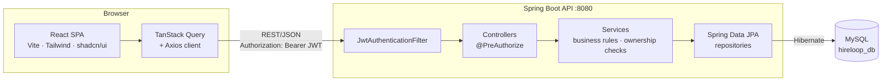
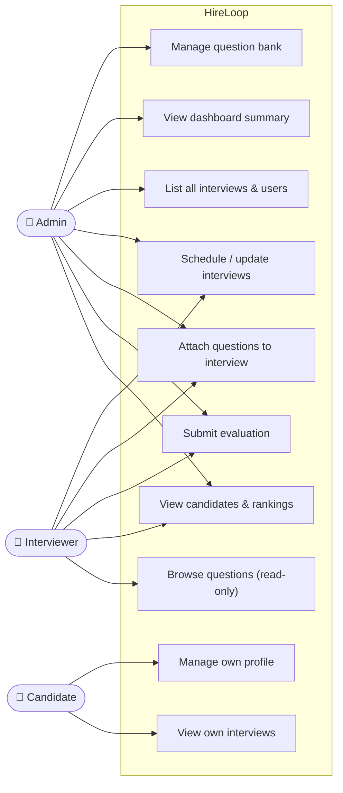
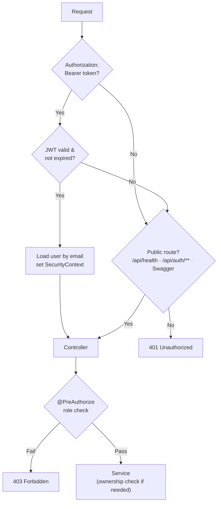
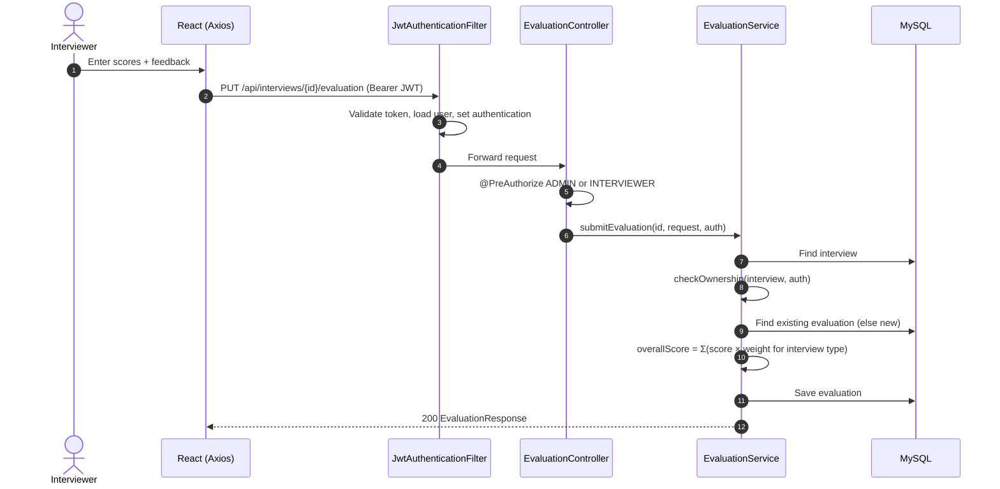
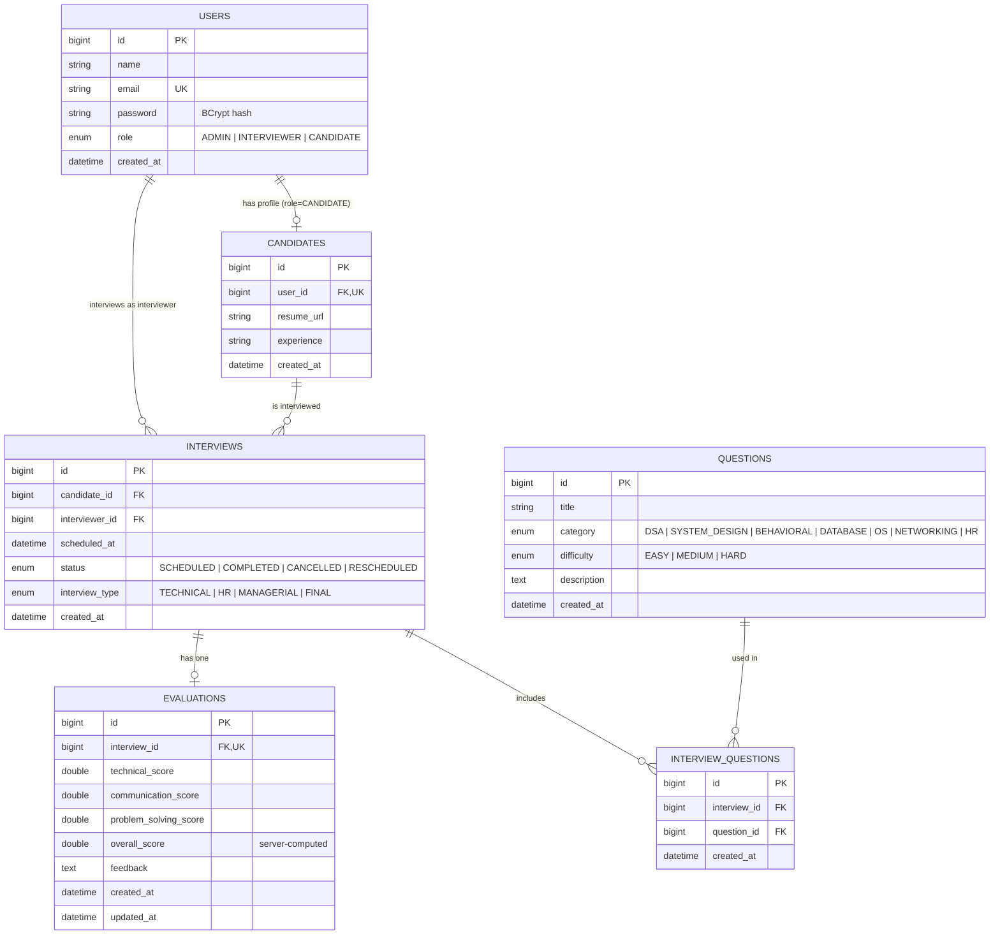

<div align="center">

# HireLoop

**A role-based interview management platform — from scheduling to weighted evaluation and candidate ranking.**


</div>

---

## 📌 Overview

Hiring teams often track interviews, questions, and feedback across spreadsheets and chat threads. **HireLoop** brings the pipeline into one application with three role-specific experiences:

- **Admins** manage the question bank, see every interview, and get an aggregate dashboard.
- **Interviewers** work only on interviews assigned to them: attach questions, submit structured scores.
- **Candidates** maintain a profile and view their own interviews.

Scores are computed **server-side** using weights that depend on the interview type, and candidates are ranked by their average overall score.

---

## ✨ Features

### ✅ Implemented

| Area | What works |
|---|---|
| **Authentication** | Register / login, BCrypt password hashing, stateless JWT (HS256, 4 h expiry), `GET /api/users/me` |
| **Authorization** | Role-based access (`ADMIN`, `INTERVIEWER`, `CANDIDATE`) via `@PreAuthorize`, plus per-interview ownership checks in the service layer |
| **Candidate profiles** | Candidates create/read/update their own profile; admins and interviewers list and view candidates |
| **Interview scheduling** | Schedule (future date enforced), fetch by id / candidate / current user, partial update (`PATCH`) of `scheduledAt` and `status` |
| **Question bank** | CRUD (admin), read-only for interviewers, filter by category and difficulty, blocked deletion of questions attached to an interview |
| **Interview questions** | Attach / list / detach questions per interview (unique per interview + question) |
| **Evaluations** | One evaluation per interview, re-submit updates it (upsert); `overallScore` is server-computed with type-based weights |
| **Rankings** | Candidates ranked by average overall score; unevaluated candidates excluded |
| **Admin dashboard** | Aggregate counts (candidates, interviewers, interviews by status, questions, evaluations) and average score |
| **API quality** | Bean Validation, consistent `ErrorResponse` shape, global exception handler, Swagger UI (springdoc) |
| **Frontend** | React SPA with protected routes per role, TanStack Query data hooks, Recharts charts, shadcn/ui components, toast notifications, error boundary, loading/empty/error states, 404 page |
| **DevOps** | Dockerfile (multi-stage) and Docker Compose for backend + MySQL |

### 🚧 In Progress
No unfinished features are tracked in the codebase.

### 🗺️ Planned
See the [Roadmap](#-roadmap).

---

## 🧰 Tech Stack

| Layer | Technologies |
|---|---|
| **Frontend** | React 19, Vite 8, React Router 7, TanStack Query 5, Axios, Tailwind CSS 4, shadcn/ui (Radix UI), Recharts, Sonner, Lucide |
| **Backend** | Java 21, Spring Boot 4.1.0, Spring Web MVC, Spring Security, Spring Data JPA / Hibernate, Bean Validation, Lombok |
| **Auth** | JWT via JJWT 0.12.6, BCrypt (`BCryptPasswordEncoder`) |
| **Database** | MySQL 8 (Hibernate `ddl-auto: update`) |
| **API docs** | springdoc-openapi 2.7.0 (Swagger UI) |
| **Build / Run** | Maven (Maven Wrapper), Docker, Docker Compose |
| **API testing** | Postman collection (`postman/`) |

---

## 🏗️ System Architecture



The backend is **package-by-feature**: `auth`, `user`, `candidate`, `interview`, `question`, `evaluation`, `dashboard`, each with its own controller / service / repository / entity / DTO layers, plus shared `config` and `common` packages.

---

## 👥 User Roles & Permissions



| Capability | ADMIN | INTERVIEWER | CANDIDATE |
|---|:---:|:---:|:---:|
| Register / log in | ✅ | ✅ | ✅ |
| Question bank – create / update / delete | ✅ | ❌ | ❌ |
| Question bank – read / filter | ✅ | ✅ | ❌ |
| Dashboard summary | ✅ | ❌ | ❌ |
| List all users / get user by id | ✅ | ❌ | ❌ |
| List all interviews | ✅ | ❌ | ❌ |
| Schedule an interview | ✅ | ✅ | ❌ |
| View / update an interview | ✅ all | ✅ own only | ❌ |
| Attach questions, submit evaluation | ✅ all | ✅ own only | ❌ |
| List candidates / view candidate / rankings | ✅ | ✅ | ❌ |
| Own candidate profile (create/read/update) | ❌ | ❌ | ✅ |
| Own interviews (`/candidate/me`) | ❌ | ❌ | ✅ |

> "Own only" is enforced in `InterviewService.checkOwnership()`, because it requires a database lookup that `@PreAuthorize` alone can't express.

---

## 🔐 Authentication & Security



- **Passwords:** hashed with BCrypt; API responses use DTOs (`UserResponse`, `CandidateResponse`) so the hash is never returned.
- **JWT:** HS256, claims `sub` (email), `role`, `userId`; expiry configured via `jwt.expiration-ms` (4 h by default). No refresh token.
- **Stateless:** `SessionCreationPolicy.STATELESS`, CSRF disabled (no cookie-based auth).
- **Secrets:** `application.yml` is gitignored; only `application.yml.example` and `.env.example` (placeholders) are committed.
- **CORS:** allows `http://localhost:5173` only.
- **Token storage (frontend):** `localStorage`; on a `401` from a non-auth call the client clears the token and redirects to `/login`.

### Example flow: submitting an evaluation



#### Overall-score weights

`overallScore` is never accepted from the client. Each score is `0–10`; weights depend on the interview type:

| Interview type | Technical | Communication | Problem solving |
|---|:---:|:---:|:---:|
| `TECHNICAL` | 0.50 | 0.20 | 0.30 |
| `HR` | 0.20 | 0.50 | 0.30 |
| `MANAGERIAL` | 0.20 | 0.40 | 0.40 |
| `FINAL` | 0.34 | 0.33 | 0.33 |

A candidate's rank is the average of `overallScore` across their evaluations (rounded to 2 decimals).

---

## 🔌 API Overview

Base URL: `http://localhost:8080` · Interactive docs: `/swagger-ui.html`

| Method | Endpoint | Access | Description |
|---|---|---|---|
| GET | `/api/health` | Public | Health check |
| POST | `/api/auth/register` | Public | Create an account |
| POST | `/api/auth/login` | Public | Authenticate, returns JWT |
| GET | `/api/users/me` | Authenticated | Current user profile |
| GET | `/api/users`, `/api/users/{id}` | ADMIN | List / get users |
| POST · GET · PUT | `/api/candidates/me` | CANDIDATE | Create / get / update own profile |
| GET | `/api/candidates`, `/api/candidates/{id}` | ADMIN, INTERVIEWER | List / get candidates |
| GET | `/api/candidates/rankings` | ADMIN, INTERVIEWER | Ranked candidates |
| GET | `/api/interviews` | ADMIN | List all interviews |
| POST | `/api/interviews` | ADMIN, INTERVIEWER | Schedule an interview |
| GET · PATCH | `/api/interviews/{id}` | ADMIN, INTERVIEWER (own) | Get / partially update |
| GET | `/api/interviews/me` | INTERVIEWER | Interviews assigned to me |
| GET | `/api/interviews/candidate/me` | CANDIDATE | My interviews |
| GET | `/api/interviews/candidate/{candidateId}` | ADMIN, INTERVIEWER | Interviews for a candidate |
| POST · GET | `/api/interviews/{id}/questions` | ADMIN, INTERVIEWER (own) | Attach / list questions |
| DELETE | `/api/interviews/{id}/questions/{questionId}` | ADMIN, INTERVIEWER (own) | Detach a question |
| PUT · GET | `/api/interviews/{id}/evaluation` | ADMIN, INTERVIEWER (own) | Submit (upsert) / fetch evaluation |
| GET | `/api/questions`, `/api/questions/{id}` | ADMIN, INTERVIEWER | List (filter `category`, `difficulty`) / get |
| POST · PUT · DELETE | `/api/questions`, `/api/questions/{id}` | ADMIN | Create / update / delete |
| GET | `/api/dashboard/summary` | ADMIN | Aggregate statistics |

**Error shape** (all handled errors):

```json
{
  "status": 400,
  "error": "Validation Failed",
  "message": "password: Password must be at least 8 characters",
  "timestamp": "2026-09-01T10:15:30"
}
```

---

## 🗄️ Domain Model



`interview_questions` has a unique constraint on `(interview_id, question_id)`.

---

## 📁 Project Structure

```
HireLoop/
├── backend/                         # Spring Boot API
│   ├── src/main/java/com/hireloop/backend/
│   │   ├── auth/                    # login/register, JWT util, filter, UserDetails
│   │   ├── user/  candidate/  interview/  question/  evaluation/  dashboard/
│   │   │   └── controller · service · repository · entity · dto
│   │   ├── config/                  # SecurityConfig, CorsConfig
│   │   └── common/                  # GlobalExceptionHandler, ErrorResponse, HealthController
│   ├── src/main/resources/application.yml.example
│   ├── Dockerfile
│   └── pom.xml
├── frontend/                        # React SPA (Vite)
│   └── src/
│       ├── pages/                   # admin, candidate, candidates, interviewer, interviews, questions, rankings
│       ├── components/              # ui (shadcn), layout, common, dashboard, interviews
│       ├── context/  hooks/         # AuthContext, TanStack Query hooks
│       ├── services/apiClient.js    # Axios instance + interceptors
│       └── utils/  layouts/
├── postman/                         # "HireLoop API" Postman collection
├── docker-compose.yml               # MySQL + backend
└── .env.example                     # placeholders for Compose
```

---

## 🚀 Getting Started

### Prerequisites
Java 21, Node.js (for Vite 8), and either a local MySQL 8 or Docker.

### Option A — Docker (backend + MySQL)

```bash
cp .env.example .env          # set MYSQL_ROOT_PASSWORD and JWT_SECRET
docker compose up --build     # API on :8080, MySQL exposed on host port 3307
```

### Option B — Run the backend locally

```powershell
# create a MySQL database named hireloop_db first
cd backend
copy src\main\resources\application.yml.example src\main\resources\application.yml
# edit application.yml: DB username/password and a long random jwt.secret
.\mvnw.cmd spring-boot:run
```

Tables are created automatically (`ddl-auto: update`).

### Frontend (both options)

```bash
cd frontend
npm install
npm run dev                   # http://localhost:5173
```

> The frontend API base URL is currently hard-coded to `http://localhost:8080/api` in [apiClient.js](frontend/src/services/apiClient.js).

### Creating Admin / Interviewer accounts

The UI registers **candidates only** (it sends `role: "CANDIDATE"`). Create other roles through the API:

```powershell
$body = @{ name='Admin'; email='admin@example.com'; password='<choose-a-password>'; role='ADMIN' } | ConvertTo-Json
Invoke-RestMethod -Method Post -Uri http://localhost:8080/api/auth/register -ContentType 'application/json' -Body $body
```

Repeat with `role='INTERVIEWER'`. (See [Known Limitations](#-known-limitations).)

---

## 🧪 Testing

| Type | Status |
|---|---|
| **API (manual/regression)** | Postman collection in [postman/](postman) with ~79 requests covering auth, users, candidates, interviews, questions and dashboard, including role-violation and edge cases (invalid IDs, malformed JSON, past dates, missing fields, ownership) |
| **Backend automated** | Only the default Spring Boot `contextLoads` test exists ([BackendApplicationTests.java](backend/src/test/java/com/hireloop/backend/BackendApplicationTests.java)) |
| **Frontend automated** | None. ESLint is configured (`npm run lint`) |

Run backend tests: `cd backend && .\mvnw.cmd test` (requires a reachable MySQL as configured).

---

## 🧠 Design Decisions

- **DTOs everywhere** – entities are never returned directly; this fixed an early password-hash leak.
- **Candidate has its own `id`** with a unique `user_id` FK (not shared-PK), so other tables reference `candidates.id` independently of `users.id`.
- **Server-computed scores** – clients submit three sub-scores only; weighting by interview type lives in one place.
- **Layered authorization** – coarse role checks with `@PreAuthorize`, fine-grained ownership in the service layer.
- **Enums as strings** (`EnumType.STRING`) for roles, statuses, types, categories and difficulties.
- **Upsert evaluation** – unique FK on `interview_id`; `PUT` creates or updates.
- **True partial `PATCH`** – omitted fields are left unchanged.
- **Stateless JWT with an explicit 401 entry point** – unauthenticated requests return `401`; authenticated-but-insufficient-role return `403`.

---

## ⚠️ Known Limitations

- **Open self-registration:** `/api/auth/register` accepts any role, so anyone can register as `ADMIN` or `INTERVIEWER`. The UI only offers candidate sign-up, but the API does not enforce it. *Not suitable for production as is.*
- No double-booking check for interviewers.
- No status-transition rules on `PATCH` (e.g. `COMPLETED → SCHEDULED` is allowed).
- No refresh tokens; JWT stored in `localStorage`.
- `resumeUrl` is not validated server-side.
- A candidate with no profile calling `GET /api/interviews/candidate/me` gets a `400` ("Candidate profile not found").
- Dashboard and ranking aggregates are computed in memory over full table reads.
- CORS origin and frontend API URL are hard-coded for local development.
- Docker Compose runs the backend and MySQL only (not the frontend).

---

<!--
Suggested: add images under docs/screenshots/ and reference them here, e.g.

-->

---

## 👤 Author

**Tarun** — [GitHub @Tarun1556](https://github.com/Tarun1556)

Project repository: [github.com/Tarun1556/HireLoop](https://github.com/Tarun1556/HireLoop)
